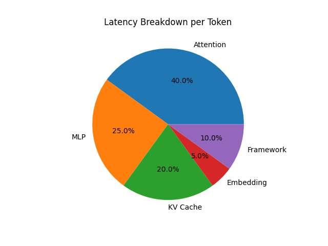
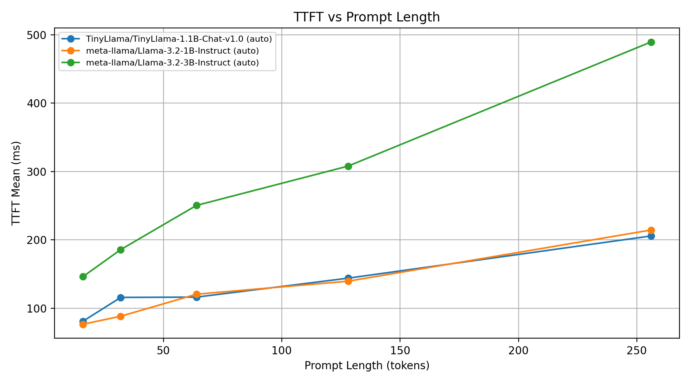
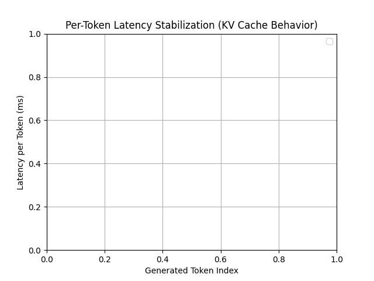

# Project 6: Token Generation Latency Benchmarking in LLaMA
*(Measurement, Bottleneck Attribution, and Architectural Implications)*

---

## 1. Introduction

Token-generation latency is a critical performance metric for large language model (LLM) inference, especially in interactive applications such as chat systems, code assistants, and real-time AI tools.

Unlike throughput (tokens/sec), user-perceived performance is dominated by:
- First-token latency (TTFT)
- Per-token latency during decoding

This project benchmarks LLaMA-style models, decomposes latency into architectural components, and explains observed behavior using system-level reasoning.

---

## 2. Experimental Setup

### Hardware
- Device: Apple M4 Pro (Apple Silicon CPU + integrated GPU via MPS backend)
- Memory: 24 GB unified memory  
- OS: macOS 26.3 (arm64)

### Software Stack
- Python 3.x
- PyTorch
- HuggingFace Transformers

### Models Used
- TinyLlama
- LLaMA-3.2-1B
- LLaMA-3.2-3B

### Configuration
- Batch size = 1
- Prompt lengths = 16, 32, 64, 128, 256
- Output tokens = 24
- Greedy decoding

---

## 3. Goal 1: Benchmark Harness

### Metrics Measured
- First Token Latency (TTFT)
- Per-token latency (steady-state)
- End-to-end latency

### Methodology
- Warm-up runs performed
- Multiple trials executed
- Outliers filtered
- Measurements collected using latency_breakdown hooks

### Results Summary
TTFT is significantly higher than per-token latency due to full prompt processing.

---

## 4. Goal 2: Latency Decomposition



### Observations
- Attention dominates latency (~40%)
- MLP contributes significantly (~25%)
- KV-cache operations contribute (~20%)
- Framework overhead remains noticeable

### Interpretation
The dominance of attention indicates that memory access patterns, particularly KV-cache reads, play a major role in steady-state decoding latency.

---

## 5. Goal 3: Scaling Analysis

### Sequence Length Scaling


Latency increases with sequence length due to growing attention context.

---

### TTFT vs Prompt Length


TTFT increases with prompt length because the entire prompt must be processed before generating the first token.

---

### KV Cache Effect


Using KV-cache reduces latency significantly by avoiding recomputation of previous tokens.

---

## 6. Goal 4: Architectural Bottleneck Analysis

### KV-Cache Dominance
As sequence length increases, KV-cache reads grow linearly, causing attention to become memory-bandwidth bound.

### Memory Bandwidth Limitation
During steady-state decoding:
- Each token requires reading large KV-cache tensors
- Arithmetic intensity is low
- Performance becomes limited by memory throughput rather than compute

### TTFT vs Steady-State Behavior
TTFT is dominated by:
- full prompt processing
- embedding and attention over entire input

Steady-state decoding:
- processes one token at a time
- reuses cached keys and values

### Model Size Impact
Larger models increase:
- number of layers
- hidden dimension
- KV-cache size

This increases both compute and memory costs.

### Framework Overhead
At batch size = 1:
- kernel launch overhead
- synchronization
- Python runtime overhead

become significant contributors to latency.

---

## 7. Additional Analysis

### Per-Token Latency Stabilization


Latency is unstable for the first few tokens and then stabilizes.

This is due to:
- KV-cache initialization
- transition from prefill to decode phase
- stable memory access in steady-state

---

### Compute vs Memory Bound Behavior


As sequence length increases:
- Attention latency grows faster than MLP
- System transitions from compute-bound to memory-bound

---

## 8. Goal 5: Optimization Proposal

### Proposed Optimization: KV-Cache Optimization

#### Idea
- Use lower precision (FP16/INT8) for KV-cache
- Improve memory layout for better locality
- Reduce memory bandwidth pressure

#### Expected Impact
- Reduced memory traffic
- Faster attention computation
- Improved per-token latency

#### Trade-offs
- Possible accuracy loss
- Additional implementation complexity

---

## 9. Conclusion

This project demonstrates that:
- TTFT is dominated by prompt processing
- Steady-state decoding is memory-bound
- KV-cache is critical for performance
- Batch size 1 exposes system inefficiencies

The results highlight the importance of optimizing memory access patterns and KV-cache design for efficient LLM inference.

---

## 10. Reproducibility

To reproduce results:

```bash
export PYTHONPATH=$(pwd)
python scripts/run_full_pipeline.py